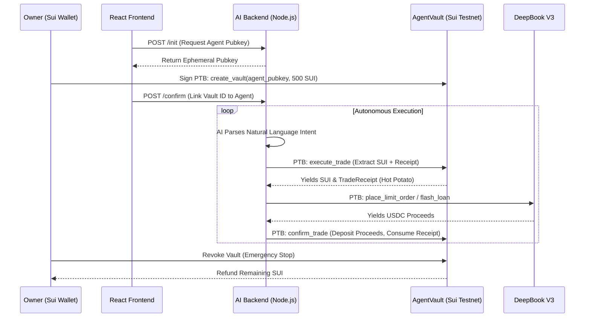

<div align="center">
  
  <h1 align="center">Sui Agent Wallet: Intent Engine</h1>
  <p align="center">
    <strong>Empowering Autonomous AI Trading on Sui DeepBook V3 with Zero-Trust Security.</strong>
  </p>
</div>

---

## 🌟 Overview

**LANS** is an advanced, non-custodial **AI Intent Engine** built exclusively for the Sui Hackathon. It translates natural language user intents into executable **Programmable Transaction Blocks (PTBs)**, enabling an autonomous AI Agent to execute complex trading strategies (Spot, Margin, Flash Loans) on **DeepBook V3**.

By pioneering the **"Direct Call Vault & Hot Potato"** Move pattern, we ensure 100% on-chain budget enforcement, protocol-scoped execution, and zero private key leakage.

---

## 🚀 Key Features

| Feature | Description |
| :--- | :--- |
| **🧠 AI Intent Parser** | Translates natural language (e.g., *"Use a flash loan to arbitrage SUI"* ) into structured PTBs via OpenRouter (Gemini/Claude). |
| **🛡️ Direct Call Vaults** | Users deposit funds into an isolated Move Vault. The Agent can only extract funds if it returns a *TradeReceipt* within the same transaction. |
| **⚡ Flash Loan Ready** | Full support for DeepBook V3 0-collateral Flash Loans, ensuring risk-free arbitrage opportunities. |
| **🛑 Owner Revocation** | The Owner retains absolute sovereignty. Vaults can be revoked instantly, refunding unspent capital. |
| **🔑 Zero Key Leakage** | The frontend uses standard `@mysten/dapp-kit` wallet signatures. The Agent's private key never leaves the secure backend environment. |

---

## 🏗️ System Architecture



---

## 🛡️ Security Highlight: The "Hot Potato" Vault

Traditional smart contract wallets face a dilemma: How can an AI agent operate autonomously without holding the owner's money outright?

We solved this using Sui's unique **Hot Potato** pattern. 
When the AI Agent calls `execute_trade`, the Contract emits the requested funds along with a `TradeReceipt` (a struct with no `drop`, `store`, or `key` abilities). 
Because the receipt is a Hot Potato, the AI's transaction **MUST** call `confirm_trade` to consume it before the transaction block ends. If the AI tries to steal the funds or route them to a malicious protocol, the transaction instantly reverts. **100% On-chain Security.**

---

## 💻 Tech Stack

- **Smart Contracts:** Sui Move (2024 Beta), DeepBook V3 Framework.
- **Frontend:** React, Vite, Tailwind CSS, shadcn/ui, `@mysten/dapp-kit`.
- **Backend:** Node.js, Express, `@mysten/sui/graphql`, `@mysten/sui/transactions`.
- **AI / NLP:** OpenRouter API (Gemini-2.5-Flash / Claude 3.5).

---

## 🛠️ Installation & Setup

### 1. Deploy Smart Contracts (Testnet)
```bash
cd sui_contracts
sui move build
sui client publish --gas-budget 100000000
```
*Note the Package ID returned from the publish command.*

### 2. Configure Environment
Copy `.env.example` to `.env` and fill in your details:
```env
OPENROUTER_API_KEY="your_api_key_here"
VITE_SUI_NETWORK="testnet"
VITE_SUI_GRAPHQL_URL="https://sui-testnet.mystenlabs.com/graphql"
VITE_AGENT_POLICY_PACKAGE_ID="<YOUR_PUBLISHED_PACKAGE_ID>"
VITE_DEEPBOOK_PACKAGE_ID="0xdee9"
```

### 3. Run the Application
```bash
npm install
npm run dev
```
Navigate to `http://localhost:3000/agents` to access the Autonomous Agent Dashboard.

---

<div align="center">
  <p>Built with ❤️ for the <strong>Sui Hackathon</strong>.</p>
</div>
